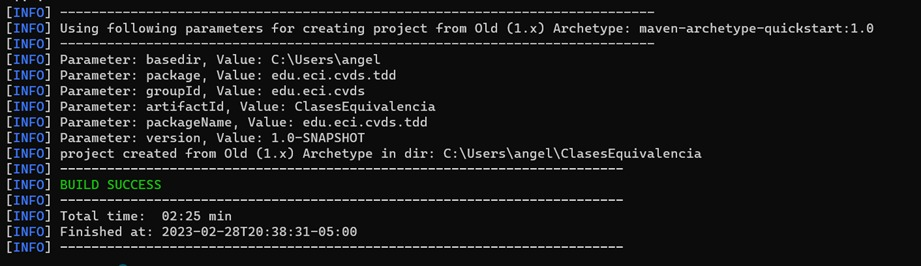
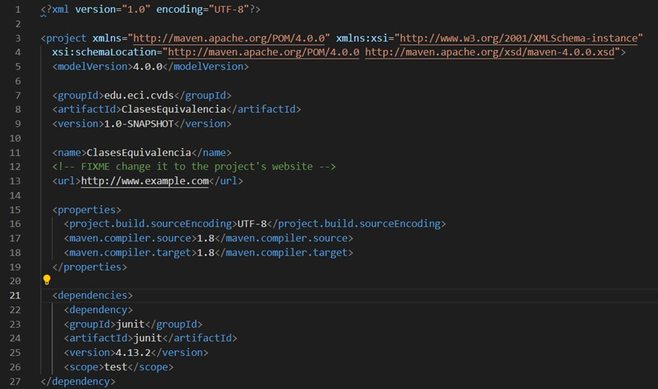
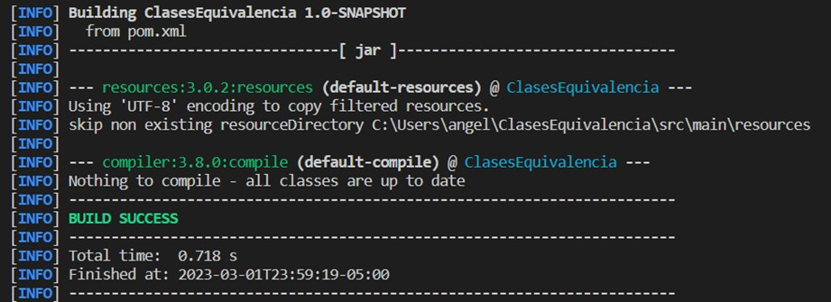
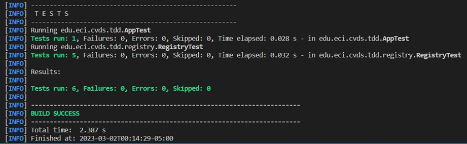
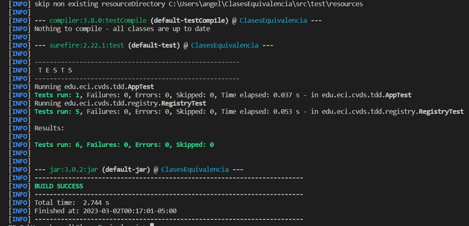
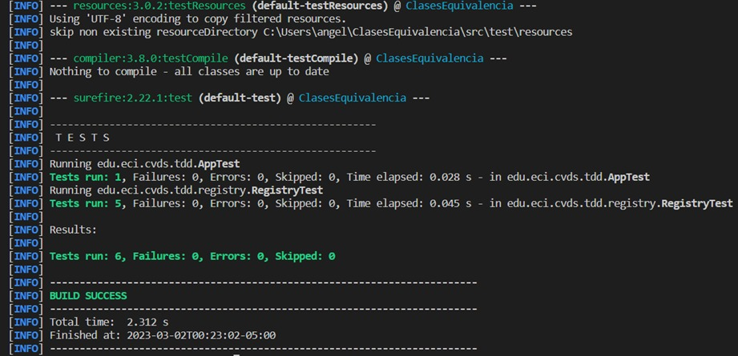

# LABORATORIO 3 - PBT CLASES DE EQUIVALENCIA
## Angel Cuervo
---
## CREAR UN PROYECTO CON MAVEN

Creamos un nuevo proyecto con los valores dados en el enunciado del laboratorio:

```
mvn archetype:generate -DgroupId=edu.eci.cvds -DartifactId=ClasesEquivalencia -Dpackage=edu.eci.cvds.tdd -DarchetypeArtifactId=maven-archetype-quickstart
```


### Actualizar y crear dependencias en el proyecto

Vamos al repo central de maven, buscamos el artefacto JUnit y agregamos la dependencia en el archivo pom.xml.la versión de java 8.



### COMPILAR Y EJECUTAR

Para compilar ejecutamos el comando `mvn compile`



Para ejecutar las pruebas unitarias ejecutamos el comando `mvn package`



## EJERCICIO “REGISTRADURÍA”

### EJECUTAR LAS PRUEBAS

Ejecutamos el comando `mvn package`:



Ejecutamos el comando `mvn test`:


